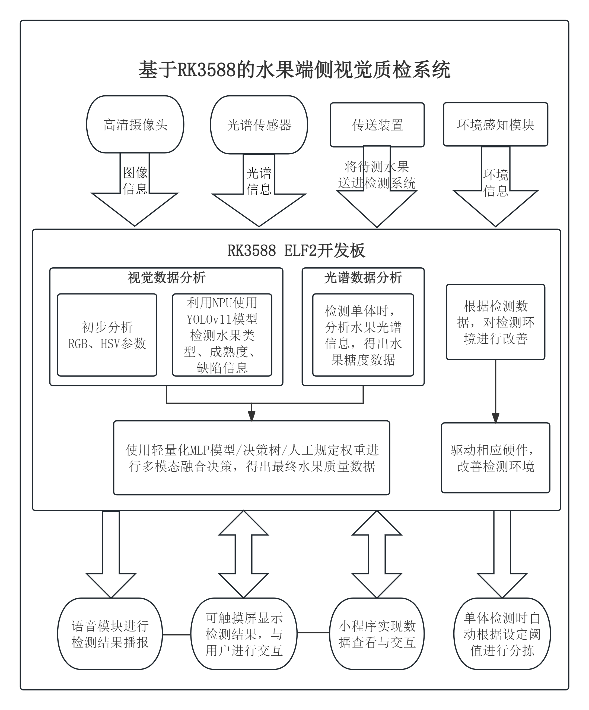

# 基于 RK3588 的水果端侧视觉质检系统

## 1 项目概述

本项目以 RK3588 ELF2 开发板为核心主控平台，依托视觉模块实现水果智能检测，辅以光谱数据采集、环境温湿度与气体成分监测功能，检测结果通过 GUI 触控界面、语音播报、微信小程序多端呈现并支持人机交互，打造一体化水果端侧质检解决方案。

### 1.1 项目背景

当前水果分级、成熟度判定及表面缺陷检测，在零售门店、仓储物流与分拣场景中仍以人工经验判断为主，存在标准不统一、作业效率低、检测数据难以留存追溯等痛点。传统专业检测设备成本高昂，难以适配中小型水果店、校园创新实践、小型仓储等轻量化部署场景。

RK3588 芯片具备强劲的端侧 AI 推理性能与丰富的外设接口，可高效搭建一体化智能检测终端。通过融合视觉检测、本地交互、联网数据管理与小程序远程查看能力，将单机检测设备升级为可管理、可追溯、可视化的边缘智能质检系统。

### 1.2 项目核心创新点

#### 1.2.1 视觉批量检测链路

以水果视觉批量检测为系统核心功能，在 ELF2 平台上完成水果种类识别、成熟度判定、表面缺陷检测、品质分级全流程处理，在保障检测精度的同时提升作业效率，突出端侧 AI 视觉的工程化应用价值。

#### 1.2.2 视觉 & 光谱双模态单体检测链路

针对单颗水果，采用视觉与光谱双模态融合的无损检测方案，实现更全面、精准的品质分析，满足高精度、专业化检测需求。

#### 1.2.3 环境辅助感知模块

集成气体传感器、温湿度传感器、光敏传感器，构建水果存储环境实时监测系统，动态采集环境数据并提供存储条件优化建议。

#### 1.2.4 平台化管理能力

搭载语音交互模块与触控显示屏，支持检测结果语音播报、GUI 界面可视化查询与检测模式切换；同时配套微信小程序，实现数据远程查看、多端同步交互，提升系统易用性与管理效率。

### 1.3 竞赛契合度

本项目精准匹配端侧 AI 视觉应用选题方向。系统对水果图像完成预处理优化，保障 1080p@30fps 实时视频流稳定显示与高效检测，充分体现端侧 AI 视觉的实时性与实用性。

## 2 系统架构

### 2.1 整体框架

高清摄像头、光谱传感器、传送装置与环境感知模块，分别采集待测水果的图像信息、光谱信息、环境信息，并传输至 RK3588 ELF2 开发板。

#### 2.1.1 视觉数据分析

依托 NPU 调用 YOLOv11 模型，完成水果种类、成熟度、缺陷检测，提取 RGB、HSV 色彩特征参数。

#### 2.1.2 光谱数据分析

解析水果光谱信息，输出糖度等关键理化指标。

#### 2.1.3 多模态决策融合

采用轻量化 MLP、决策树或人工加权算法，融合视觉与光谱数据，输出最终水果品质结果。

#### 2.1.4 环境调控

依据检测数据驱动硬件，优化检测与存储环境。

#### 2.1.5 多端交互输出

通过触控屏显示结果、语音模块播报、小程序实现数据查看与远程交互。

#### 2.1.6 自动传输装置

根据用户指令，控制直流减速电机传送带运送待测水果，单体检测时舵机进行分拣

### 2.2 整体框架图

